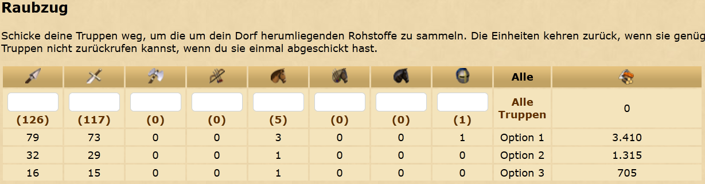

# Raubzug Rechner

Durch das User-Script wird eine Verteilung der Einheiten auf die verschiedenen Sammel-Optionen vom Raubzug berechnet, dass sie gleichmäßig ausgelastet sind.

## Installieren
* [Tampermonkey](https://www.tampermonkey.net/) installieren
* [UserScript öffnen](https://raw.githubusercontent.com/Ichaelus/ds-raubzug-rechner/main/raubzug-rechner.user.js)
* Im Spiel: Versammlungsplatz->Raubzug öffnen

Die Infos werden angezeigt, sobald eine Sammel-Option verfügbar ist
